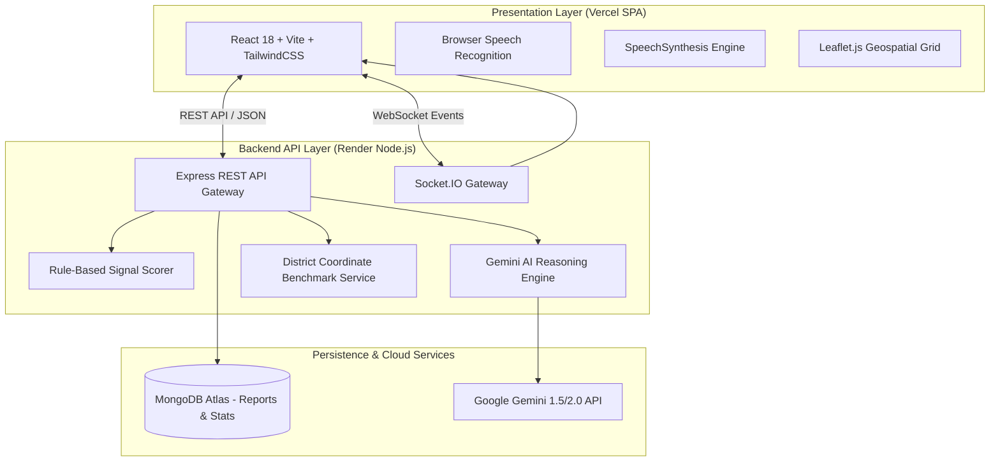
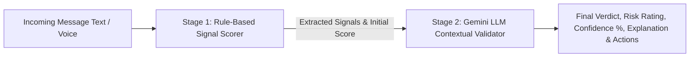

# 🛡️ Citizen Fraud Shield (CFS)
## Executive System Architecture & Functional Specifications Document

---

## 1. Executive Summary

**Citizen Fraud Shield (CFS)** is an enterprise-grade, AI-powered cyber fraud detection and real-time geospatial response platform engineered specifically for the Indian cybersecurity ecosystem. Designed for dual operational modes, CFS serves both **citizens** facing sophisticated digital scams (e.g., Digital Arrests, Impersonation, Fake KYC, Stock Trading Scams, OTP Theft) and **law enforcement agencies (LEAs)** requiring centralized threat intelligence, district-level risk aggregation, and automated incident response prioritization.

### Key Objectives
1. **Empower Citizens**: Provide a WhatsApp-style conversational AI assistant capable of analyzing scam messages, links, and audio transcriptions in 10 major Indian languages with real-time explainability scores and voice output.
2. **Accelerate Police & LEA Response**: Aggregate citizen-reported incidents into a **Geospatial Command Center** visualizing threat density across 44 benchmarked Indian districts with real-time risk scoring (0–100) and automated Gemini AI tactical patrol recommendations.
3. **Bridge Communication Barriers**: Native support for English, Hindi, Marathi, Gujarati, Punjabi, Bengali, Tamil, Telugu, Kannada, and Malayalam with browser Speech-to-Text (STT) and single-click Start/Stop Text-to-Speech (TTS) synthesis.

---

## 2. System Architecture & High-Level Design

The platform adopts a decoupled micro-architecture combining a React Single Page Application (SPA) frontend with a Node.js/Express REST & WebSocket backend, backed by MongoDB Atlas and Google Gemini AI.



---

## 3. Core Technical Modules & Innovations

### 3.1 2-Stage Hybrid AI Scam Classifier
To deliver both sub-50ms execution speed and deep semantic reasoning, CFS implements a **2-stage hybrid detection architecture**:



- **Stage 1 (Rule-Based Feature Scorer)**:
  Scans text against 12 high-priority threat signal detectors:
  - *Urgency & Threat*: Imminent block, account closure within 24 hours.
  - *Authority Impersonation*: CBI, Police, TRAI, Reserve Bank of India, ED.
  - *Financial & Payment Traps*: Fee payment, refund claim, lottery win, UPI pin.
  - *Digital Arrest Patterns*: Video call requirement, isolation instructions.
  - *OTP & Link Harvesting*: Unverified short URLs (`bit.ly`, `t.me`), credential requests.
- **Stage 2 (Gemini LLM Semantic Validator)**:
  Evaluates semantic nuance, cross-references Stage 1 signals, filters out harmless/meaningless inputs (e.g., `"hello 123"` returns `Unable to Determine` with low confidence instead of false positive scams), and generates human-understandable explainability panels.

---

### 3.2 Geospatial Command Center & Hotspot Engine
The Geospatial Command Center processes citizen report telemetry across Indian districts to calculate a dynamic **District Hotspot Score (0–100)**:

$$\text{Hotspot Score} = \min\left(100, \left(N_{\text{total}} \times 4\right) + \left(N_{\text{critical}} \times 15\right) + \left(V_{\text{recent}} \times 10\right)\right)$$

Where:
- $N_{\text{total}}$ = Total valid report count in district
- $N_{\text{critical}}$ = Critical severity report count
- $V_{\text{recent}}$ = Velocity multiplier of reports submitted within the last 24 hours

#### Single Source of Truth for Coordinates (`coordinateService.ts`)
To eliminate incorrect ocean marker placement:
- All coordinates are benchmarked against canonical GIS data in `district_coordinates.csv`.
- **Geographic Boundary Constraint**: Strictly enforces $8.0^\circ \text{ N} \le \text{Lat} \le 37.5^\circ \text{ N}$ and $68.0^\circ \text{ E} \le \text{Lng} \le 97.5^\circ \text{ E}$.
- **Inverted Value Autocorrect**: Automatically swaps inverted latitude/longitude coordinates.
- **Anti-Overlap Micro-Clustering**: Applies radial offsets ($\Delta r = 0.008^\circ$) to co-located markers so every district remains individually clickable on Leaflet.js.

---

### 3.3 10-Language Multilingual & Voice Engine
CFS features comprehensive internationalization (i18n) across 10 major Indian languages:

| Language Code | Language | Native Name | TTS BCP47 Voice Mapping |
| :---: | :---: | :---: | :---: |
| `en` | English | English | `en-IN` / `en-US` |
| `hi` | Hindi | हिंदी | `hi-IN` |
| `mr` | Marathi | मराठी | `mr-IN` |
| `gu` | Gujarati | ગુજરાતી | `gu-IN` |
| `pa` | Punjabi | ਪੰਜਾਬੀ | `pa-IN` |
| `bn` | Bengali | বাংলা | `bn-IN` |
| `ta` | Tamil | தமிழ் | `ta-IN` |
| `te` | Telugu | తెలుగు | `te-IN` |
| `kn` | Kannada | ಕನ್ನಡ | `kn-IN` |
| `ml` | Malayalam | മലയാളം | `ml-IN` |

- **Speech-to-Text (STT)**: Integrated microphone button using `webkitSpeechRecognition` with live sentence transcription.
- **Text-to-Speech (TTS)**: Dynamic `useAudioPlayer` hook supporting a unified **Start / Stop Toggle Button** (`Volume2` Listen vs `Square` Stop with pulsing red indicator).

---

### 3.4 Dual-Theme Engine (Dark / Light / System)
Configured using Tailwind CSS `darkMode: 'class'` and CSS Custom Property RGB tokens (`rgb(var(--c-graphite-900) / <alpha-value>)`):
- **🌙 Dark Mode (`html.dark`)**: High-contrast cyber-security command center aesthetic (`#0B0D11` background, `#14181F` panels, `#F8FAFC` typography).
- **☀️ Light Mode (`:root` / `html.light`)**: Modern government dashboard theme (`#F8FAFC` page background, `#FFFFFF` crisp cards, `#0F172A` dark slate text).
- **⚡ Anti-Flash Head Script**: Inline initialization in `index.html` preventing theme flicker on page reloads.

---

## 4. Database Schemas

### 4.1 `Report` Schema (MongoDB Mongoose)
```typescript
interface IReport {
  reportId: string;           // e.g. "REP-2026-8941"
  title: string;              // Incident short title
  description: string;        // Full citizen report narrative
  category: string;           // "OTP Scam", "Digital Arrest", "Fake KYC", etc.
  district: string;           // District name (e.g. "Lucknow")
  state: string;              // State name (e.g. "Uttar Pradesh")
  latitude: number;           // Benchmarked latitude
  longitude: number;          // Benchmarked longitude
  severity: 'Low' | 'Medium' | 'High' | 'Critical';
  status: 'Pending' | 'Under Investigation' | 'Resolved' | 'Flagged';
  createdAt: Date;
}
```

### 4.2 `DistrictStats` Schema (MongoDB Mongoose)
```typescript
interface IDistrictStats {
  district: string;
  state: string;
  latitude: number;
  longitude: number;
  totalReports: number;
  criticalCount: number;
  highCount: number;
  mediumCount: number;
  lowCount: number;
  hotspotScore: number;       // Range: 0 to 100
  aiRecommendation?: string;  // Gemini-generated patrol advice
  lastUpdated: Date;
}
```

---

## 5. API Endpoint Specifications

| Method | Path | Description | Request Body / Query | Success Response |
| :--- | :--- | :--- | :--- | :--- |
| `POST` | `/api/predict` | Run 2-stage scam detection | `{ "message": "string" }` | `{ verdict, confidence, risk, explanation, triggeredSignals }` |
| `POST` | `/api/translate` | Localize verdict & reasoning | `{ "data": {...}, "targetLanguage": "hi" }` | `{ verdict, explanation, language }` |
| `GET` | `/api/dashboard` | Command Center summary metrics | `None` | `{ summary, markers, analytics }` |
| `GET` | `/api/hotspots` | Fetch high-risk districts | `None` | `{ hotspots: [...], count: N }` |
| `GET` | `/api/reports` | Paginated report registry | `?state=&district=&severity=&page=1` | `{ reports: [...], total, page, pages }` |
| `POST` | `/api/reports` | Submit report & recalculate hotspot | `{ title, description, category, district, state, latitude, longitude, severity }` | `{ reportId, status, message }` |

---

## 6. Deployment & Infrastructure Pipeline

```text
       ┌────────────────────────┐
       │   GitHub Repository    │
       │ (main branch push)     │
       └───────────┬────────────┘
                   │
         ┌─────────┴─────────┐
         ▼                   ▼
┌─────────────────┐ ┌──────────────────┐
│  Vercel Deploy  │ │  Render Deploy   │
│  (Frontend SPA) │ │ (Express API)    │
└────────┬────────┘ └────────┬─────────┘
         │                   │
         └─────────┬─────────┘
                   ▼
┌──────────────────────────────────────┐
│ MongoDB Atlas Cluster & Gemini Cloud │
└──────────────────────────────────────┘
```

- **Frontend Hosting**: Vercel SPA (`https://et-ai-project.vercel.app`) with automatic Vite production chunking.
- **Backend API & WebSockets**: Render Web Service (`https://et-ai-project.onrender.com`) running Node.js 18 with CORS enabled (`origin: true`) for REST & Socket.IO.
- **Database**: MongoDB Atlas Cluster `fraud_shield` database.

---

## 7. Conclusion

**Citizen Fraud Shield** delivers a scalable, production-ready solution to one of India's most pressing cyber challenges. By synthesizing 2-stage explainable AI detection, 10-language accessibility, real-time WebSockets, and geospatial police command intelligence into a cohesive platform, CFS empowers citizens while providing law enforcement with actionable insights to combat digital fraud effectively.
