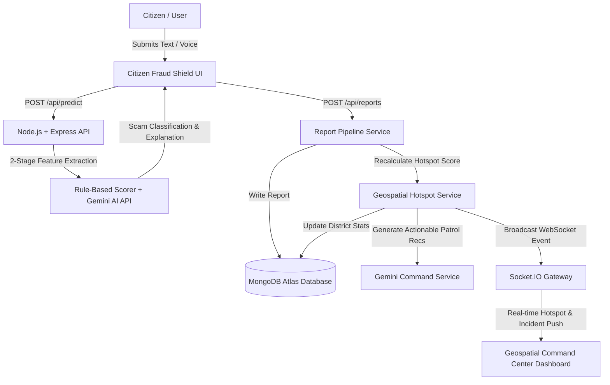

# 🛡️ Citizen Fraud Shield (CFS)
### AI-Powered Cyber Fraud Detection & Geospatial Command Center

[](https://nodejs.org/)
[](https://www.typescriptlang.org/)
[](https://reactjs.org/)
[](https://www.mongodb.com/atlas)
[](https://socket.io/)
[](https://leafletjs.com/)
[](https://ai.google.dev/)

> **Citizen Fraud Shield** is an end-to-end, production-ready AI platform built for citizens and law enforcement agencies across India. It combines a 2-stage explainable AI scam detection pipeline with a real-time Geospatial Command Center to identify, classify, and prioritize cyber fraud threats across Indian districts.

---

## 📸 Key Capabilities & Highlights

| Feature | Description |
| :--- | :--- |
| **🛡️ AI Scam Checker** | WhatsApp-style conversational UI with 2-stage rule-based + Gemini AI scam classification, explainability breakdown, and risk scoring. |
| **🌐 Multilingual Support (10 Languages)** | Instant translation and localized UI for English, Hindi, Marathi, Gujarati, Punjabi, Bengali, Tamil, Telugu, Kannada, and Malayalam. |
| **🔊 Multilingual Voice & Audio** | Browser Speech-to-Text input + Text-to-Speech (TTS) voice playback in all 10 languages with a single Start/Stop toggle button. |
| **🛰️ Geospatial Command Center** | Interactive Leaflet geospatial map visualizing fraud hotspots across 44 benchmarked Indian districts with 0–100 risk scoring. |
| **⚡ Real-time Socket.IO Feed** | Instant WebSocket streaming of citizen-submitted fraud reports and district hotspot rating recalculations. |
| **🤖 Gemini AI Enforcement** | Automated generation of tactical law enforcement recommendations per district based on critical report density. |
| **🌓 Theme Engine (Dark/Light/System)** | Dual-theme system featuring Dark Cyber-Security mode, Light Government Dashboard mode, and OS System preference matching. |
| **🧭 Guided Tour & Demo Mode** | Built-in interactive onboarding walkthrough and automated 1-click hackathon demonstration mode. |

---

## 🏗️ Architecture Overview



---

## 🛠️ Technology Stack

### **Frontend**
- **Core**: React 18, Vite, TypeScript
- **Styling**: TailwindCSS (Custom Graphite & Slate theme tokens), Lucide React Icons
- **Geospatial Mapping**: Leaflet.js, CartoDB Dark & Light Tiles
- **Real-time**: Socket.IO Client
- **Voice**: Web Speech Recognition & SpeechSynthesis APIs

### **Backend**
- **Core**: Node.js, Express.js, TypeScript (`ts-node-dev`)
- **Database**: MongoDB Atlas, Mongoose ORM
- **AI Integration**: Google Gemini 1.5 / 2.0 API (`@google/genai`)
- **Real-time Server**: Socket.IO Server
- **Dataset Import**: CSV/JSON Importer (`district_coordinates.csv`, `i4c_fraud_reports.csv`)

---

## 📂 Project Structure

```text
ET-AI-Project/
├── backend/
│   ├── src/
│   │   ├── config/             # Environment variables & constants
│   │   ├── controllers/        # Express route controllers
│   │   ├── dataset/            # Benchmark datasets (districts, I4C reports)
│   │   ├── models/             # Mongoose schemas (Report, DistrictStats)
│   │   ├── routes/             # API routes (/predict, /reports, /dashboard)
│   │   ├── scripts/            # Dataset importer & DB seeder script
│   │   ├── services/           # AI extraction, scoring, map & Socket services
│   │   └── server.ts           # Application entry point
│   └── package.json
│
├── frontend/
│   ├── src/
│   │   ├── components/         # Dashboard, Map, Reports, Tour, Help modals
│   │   ├── context/            # Settings & Multilingual Contexts
│   │   ├── hooks/              # Socket, Audio Player, Toast custom hooks
│   │   ├── locales/            # 10 Indian language translation dictionaries
│   │   ├── pages/              # Command Center, AI Checker, Reports, Timeline
│   │   └── App.tsx             # Main routing & app container
│   ├── tailwind.config.js      # Theme configuration with dark mode support
│   └── package.json
└── README.md
```

---

## 🚀 Getting Started

### **Prerequisites**
- Node.js (v18.0.0 or higher)
- npm (v9.0.0 or higher)
- MongoDB Atlas cluster URL or local MongoDB instance
- Gemini API Key ([Get Key Here](https://aistudio.google.com/))

---

### **1. Clone the Repository**
```bash
git clone https://github.com/utkarsh2338/ET-AI-Project.git
cd ET-AI-Project
```

---

### **2. Backend Setup**

```bash
cd backend
npm install
```

Create a `.env` file inside the `backend` folder:
```env
PORT=3000
NODE_ENV=development
MONGODB_URI=your_mongodb_atlas_connection_string
GEMINI_API_KEY=your_gemini_api_key
SOCKET_CORS_ORIGIN=http://localhost:5173
DEDUP_WINDOW_SECONDS=300
```

#### **Seed Database Benchmarks & Reports**
Run the dataset import script to populate MongoDB Atlas with 44 Indian districts and historical reports:
```bash
npx ts-node src/scripts/importData.ts --clear
```

#### **Start Backend Development Server**
```bash
npm run dev
```
Backend server will run on `http://localhost:3000`.

---

### **3. Frontend Setup**

Open a new terminal window:
```bash
cd frontend
npm install
```

Start the Vite development server:
```bash
npm run dev
```
Frontend web application will open at `http://localhost:5173`.

---

## 📡 API Reference

### **AI Scam Detector**
- `POST /api/predict`
  - **Payload**: `{ "message": "Your SBI account is blocked. Click here to update KYC." }`
  - **Response**: Returns classification verdict (`Scam`, `Likely Scam`, `Needs Manual Review`, `Safe`), confidence score, risk severity, and feature signals.

### **Multilingual Translation**
- `POST /api/translate`
  - **Payload**: `{ "data": { ... }, "targetLanguage": "hi" }`
  - **Response**: Localized verdict and explanation in target language.

### **Geospatial Command Center**
- `GET /api/dashboard` — Returns summary KPIs, 44 district map markers, and chart analytics.
- `GET /api/hotspots` — Returns top district hotspots sorted by risk score.
- `GET /api/district/:name` — Returns detailed incident breakdown for a specific district.

### **Fraud Reporting**
- `GET /api/reports` — Paginated query with state/district/severity filters.
- `POST /api/reports` — Submits a new citizen report, triggers hotspot recalculation & Socket.IO broadcast.

---

## 🗺️ Single Source of Truth for Geospatial Coordinates

All geospatial district markers are benchmarked against `backend/src/dataset/district_coordinates.csv`. The `coordinateService` ensures:
1. **Zero Ocean Markers**: Coordinates are strictly bounded within mainland Indian territory (`8.0° N <= Lat <= 37.5° N`, `68.0° E <= Lng <= 97.5° E`).
2. **Swapped Coordinate Autocorrect**: Inverted coordinates (`lat > 50`) are automatically corrected before rendering.
3. **Anti-Overlap Radial Offset**: Overlapping markers at identical district centers automatically apply micro-offsets to maintain full clickability.

---

## 📜 License

This project was built for hackathon demonstration purposes. Distributed under the MIT License.
